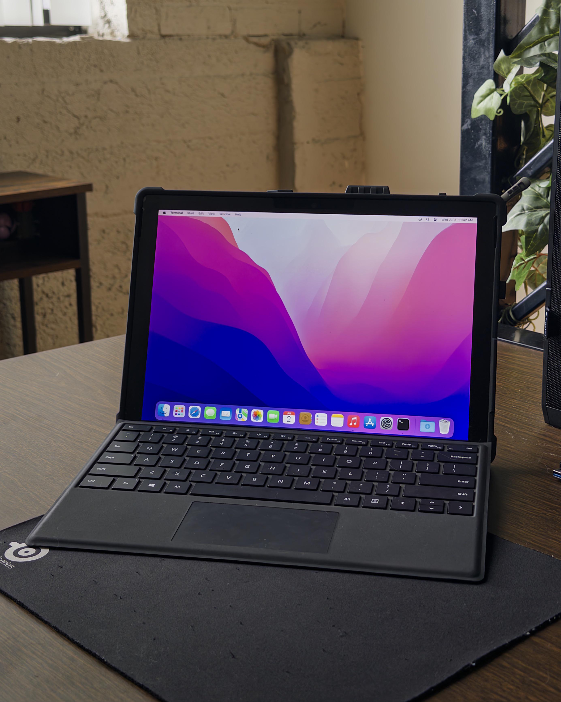

# Surface Pro 6 Hackintosh EFI
# OpenCore 1.0.4

EFI for Hackintosh Monterey on Surface Pro 6 (i5, 8GB RAM).  
**ONLY TESTED WITH MONTEREY (USE AT YOUR OWN RISK)**

## Working
- Wi-Fi ([chris1111 Wireless-USB](https://github.com/chris1111/Wireless-USB-Big-Sur-Adapter))
- Audio
- Surface Typecover Keyboard & Trackpad
- USB Mouse & Keyboard
- Touchscreen & Battery status ([Xiashangning BigSurface](https://github.com/Xiashangning/BigSurface0))
- Sleep/Wake
- USB ports and hubs
- DisplayPort output

## Not Working
- Cameras

## Not Tested
- Bluetooth

## How to Use
1. Create a macOS Monterey installer USB.
2. Copy the entire EFI folder to your EFI partition.
3. Configure your SerialNumber, MLB, and SystemUUID using ([CorpNewt GenSMBIOS](https://github.com/corpnewt/GenSMBIOS)). (Use MacBookPro15,2)
4. Set ROM to your Wi-Fi USB's MAC address.
5. Boot using OpenCore. For more info, see the ([OpenCore Install Guide](https://dortania.github.io/OpenCore-Install-Guide/prerequisites.html#prerequisites)).

## Notes
- Tested on i5 8GB Surface Pro 6 only.
- Disable Secure Boot in BIOS.
